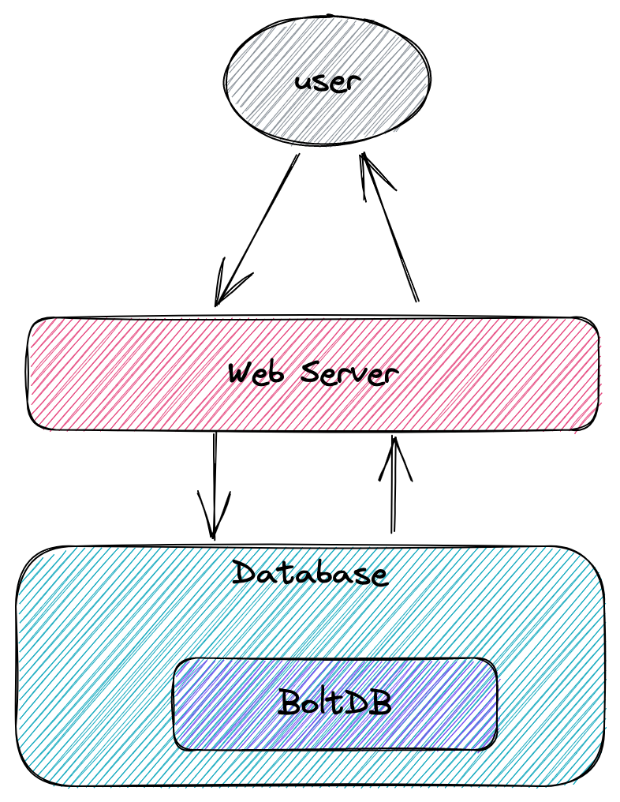
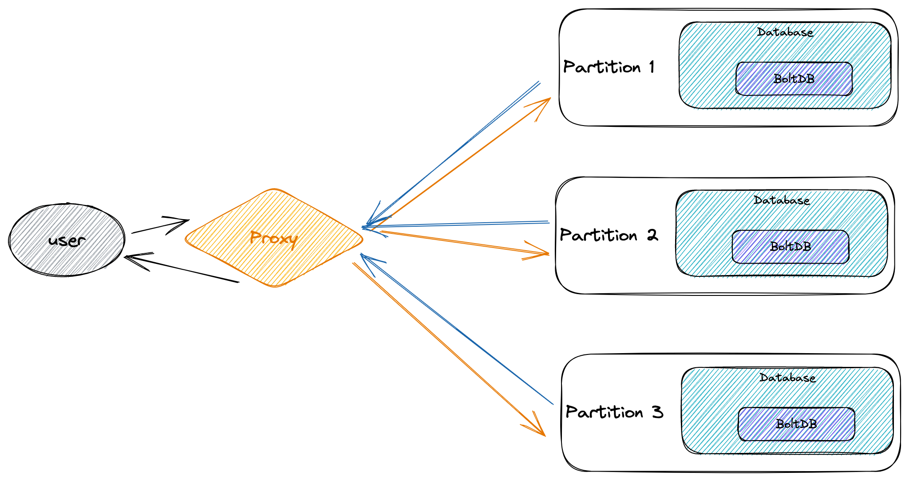

# Distributed K-V Database by GO

Credit to the original YouTuber: [SovietReliable](https://www.youtube.com/channel/UC3Lhz4sPFPbH2TDtTxmNiQg)

## Part1 Single Partition Database

The single partition is pretty simple, and running on a single node. We use [BoltDB](https://github.com/boltdb/bolt) as the core engine of our database. Above the database engine we have a Http server as a API layer to manage the `Get` and `Set` request from user.



## Static Partition

The idea of static partition is simple. We calculate the partition index based on the hash function of the key:

`index = Hash(key) % PartitionCount`

Each partition is configured using a [TOML](https://github.com/toml-lang/toml) configure file. An example of `Atlanta` partition is like:

```toml
[Partition]
name = "Atlanta"
idx = 0
host_address = "localhost:8080"
```

A proxy server is listening at `8888` to route all request to the specific partition based on the `Hash(key)`. The proxy server maintain a map of the hash index to the host address of each partition in order to find the correct partition address.



